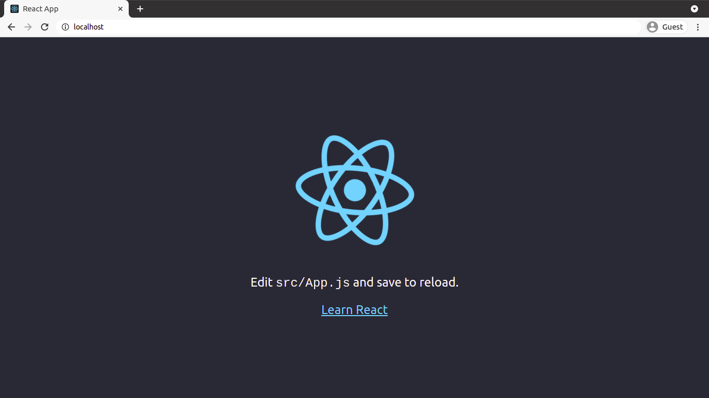

## Compose sample application

### An project deploy React Application with Nginx

Project structure:

```
├── compose.yaml
├── Dockerfile
├── .dockerignore
├── .nginx
│   └── nginx.conf
├── package.json
├── public
│   ├── ...
│   └── robots.txt
├── README.md
├── src
│   ├── ...
│   └── App.js
└── yarn.lock

```

[_compose.yaml_](compose.yaml)

```
services:
  frontend:
    build:
      context: .
    container_name: frontend
    ports:
      - "80:80"
```

The compose file defines an application with an services `frontend`.
When deploying the application, docker compose maps port 80 of the frontend service container to port 80 of the host as specified in the file.  

## Deploy with docker compose

```
$ docker compose up -d
Building frontend
Sending build context to Docker daemon   1.49MB

Step 1/17 : FROM node:lts AS development
 ---> 9153ee3e2ced
Step 2/17 : WORKDIR /app
 ---> Using cache
 ---> a7909d92148a
Step 3/17 : COPY package.json /app/package.json
 ---> 2e690dfe99b2
Step 4/17 : COPY package-lock.json /app/package-lock.json
 ---> dd0132803f43
 .....
Step 16/17 : COPY --from=build /app/build .
 ---> Using cache
 ---> 447488bdf601
Step 17/17 : ENTRYPOINT ["nginx", "-g", "daemon off;"]
 ---> Using cache
 ---> 6372a67cf86f
Successfully built 6372a67cf86f
Successfully tagged react-nginx_frontend:latest
```

## Expected result

Listing containers must show containers running and the port mapping as below:

```
$ docker ps

CONTAINER ID   IMAGE                  COMMAND                  CREATED              STATUS              PORTS                               NAMES
b6d00a4974ce   react-nginx_frontend   "nginx -g 'daemon of…"   About a minute ago   Up About a minute   0.0.0.0:80->80/tcp, :::80->80/tcp   frontend
```

After the application start, navigate to http://localhost in your browser:


Stop and remove the containers

```
$ docker compose down
Stopping frontend ... done
Removing frontend ... done
Removing network react-nginx_default
```

## Use with Docker Development Environments

You can use this sample with the Dev Environments feature of Docker Desktop.


To develop directly on the services inside containers, use the HTTPS Git url of the sample:
```
https://github.com/docker/awesome-compose/tree/master/react-nginx
```